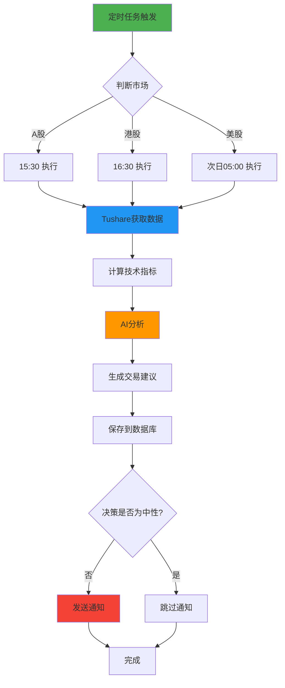

# 📈 股票监控功能使用指南

## 概述

StockPulse.AI 现已支持股票监控功能，可以监控 **A股**、**港股** 和 **美股**，通过 Tushare 数据源获取实时数据，结合 AI 分析和技术指标生成交易建议。

## 功能特性

### 🌏 支持的市场

- **港股（HK）**: 腾讯控股、小米集团、阿里巴巴等
- **美股（US）**: BTCS 等
- **A股（CN）**: 贵州茅台等

### 📊 技术指标

- RSI (相对强弱指数)
- MACD (指数平滑移动平均线)
- 布林带 (Bollinger Bands)
- SMA/EMA (移动平均线)

### 🤖 AI 分析

- 基于 DeepSeek AI 的智能分析
- 5 级交易信号：强烈买入、买入、中性、卖出、强烈卖出
- 自动生成分析理由

### 📱 通知系统

- 邮件通知
- ntfy 推送通知
- 企业微信机器人通知

## 配置说明

### 1. 添加 Tushare Token

在 `.env` 文件中配置：

```env
# Tushare 数据源配置
TUSHARE_TOKEN="your_tushare_token_here"
```

### 2. 配置监控时间

```env
# 股票监控时间（Cron 表达式）
STOCK_MONITOR_CN_TIME="30 15 * * 1-5"  # A股收盘后 15:30
STOCK_MONITOR_HK_TIME="30 16 * * 1-5"  # 港股收盘后 16:30
STOCK_MONITOR_US_TIME="0 5 * * 2-6"    # 美股收盘后（北京时间次日 05:00）
```

### 3. 默认监控股票列表

系统默认监控以下股票：

| 市场 | 代码 | 名称 |
|------|------|------|
| 港股 | 00700.HK | 腾讯控股 |
| 港股 | 01810.HK | 小米集团 |
| 港股 | 09988.HK | 阿里巴巴 |
| 美股 | BTCS | BTCS Inc |
| A股 | 600519.SH | 贵州茅台 |

## 使用方法

### 方法一：独立运行股票监控

```bash
# 运行测试脚本
npm run test:stock
```

### 方法二：通过主应用控制

在 Electron 应用中，可以通过 IPC 通信控制股票监控：

```javascript
// 启动股票监控
ipcRenderer.send('start-stock-monitor');

// 停止股票监控
ipcRenderer.send('stop-stock-monitor');

// 获取监控状态
ipcRenderer.send('get-stock-monitor-status');

// 添加监控股票
ipcRenderer.send('add-stock', {
    symbol: '00700.HK',
    name: '腾讯控股',
    market: 'HK'
});

// 移除监控股票
ipcRenderer.send('remove-stock', '00700.HK');
```

### 方法三：程序化使用

```javascript
const { StockMonitor } = require('./src/backend/StockMonitor.js');

async function main() {
    // 创建实例
    const monitor = new StockMonitor();
    
    // 启动监控
    await monitor.start();
    
    // 添加新的监控股票
    monitor.addStock({
        symbol: '03690.HK',
        name: '美团',
        market: 'HK'
    });
    
    // 获取状态
    console.log(monitor.getStatus());
}

main();
```

## 股票代码格式

### A股

- 上海证券交易所：`股票代码.SH`（如：600519.SH - 贵州茅台）
- 深圳证券交易所：`股票代码.SZ`（如：000001.SZ - 平安银行）

### 港股

- 香港交易所：`股票代码.HK`（如：00700.HK - 腾讯控股）
- 注意：港股代码需要补足 5 位数字

### 美股

- 直接使用股票代码（如：AAPL、TSLA、BTCS）

## 数据存储

所有股票数据都存储在 SQLite 数据库中：

```sql
-- 查看最近的股票分析决策
SELECT * FROM decision_logs 
WHERE symbol LIKE '%HK' 
ORDER BY created_at DESC 
LIMIT 10;

-- 查看特定股票的K线数据
SELECT * FROM kline_data 
WHERE symbol = '00700.HK' 
ORDER BY open_time DESC 
LIMIT 20;

-- 查看技术指标数据
SELECT * FROM indicators 
WHERE symbol = '00700.HK' 
ORDER BY timestamp DESC 
LIMIT 10;
```

## 工作流程



## 监控时间说明

### A股监控时间

- **执行时间**: 周一至周五 15:30
- **原因**: A股交易时间为 09:30-15:00，在收盘后半小时执行分析

### 港股监控时间

- **执行时间**: 周一至周五 16:30
- **原因**: 港股交易时间为 09:30-16:00，在收盘后半小时执行分析

### 美股监控时间

- **执行时间**: 周二至周六 05:00（北京时间）
- **原因**: 对应美东时间前一天 16:00（收盘时间）
- **注意**: 夏令时和冬令时可能需要调整

## API 使用限制

### Tushare 积分说明

Tushare 使用积分制度，不同接口消耗不同积分：

- 日线数据：每次调用消耗少量积分
- 分钟线数据：消耗较多积分
- 建议：合理设置监控频率，避免频繁调用

### 推荐配置

- 每天监控 1-2 次（收盘后）
- 每次监控 5-10 只股票
- 使用日线数据而非分钟线

## 故障排查

### 问题 1: Tushare API 调用失败

**原因**：
- Token 未配置或错误
- 积分不足
- 网络连接问题

**解决方案**：
```bash
# 检查配置
grep TUSHARE_TOKEN .env

# 查看错误日志
tail -f logs/error-$(date +%Y-%m-%d).log
```

### 问题 2: 无法获取股票数据

**原因**：
- 股票代码格式错误
- 该股票暂停交易
- 日期范围无交易数据

**解决方案**：
- 检查股票代码格式是否正确
- 查看该股票是否正常交易
- 调整日期范围

### 问题 3: AI 分析失败

**原因**：
- DeepSeek API Key 未配置
- API 配额耗尽
- 网络连接问题

**解决方案**：
```bash
# 检查 DeepSeek 配置
grep DEEPSEEK_API_KEY .env

# 查看 AI 分析日志
grep "DeepSeek" logs/application-$(date +%Y-%m-%d).log
```

## 扩展开发

### 添加新的监控股票

编辑 `src/backend/StockMonitor.js`：

```javascript
initializeStocks() {
    return [
        // 现有股票...
        
        // 添加新股票
        { symbol: '03690.HK', name: '美团', market: 'HK' },
        { symbol: '002594.SZ', name: '比亚迪', market: 'CN' },
        { symbol: 'TSLA', name: '特斯拉', market: 'US' }
    ];
}
```

### 自定义分析策略

修改 AI 分析提示词：

```javascript
buildAnalysisPrompt(stock, kline, indicators) {
    return `
    根据你的需求自定义分析内容...
    `;
}
```

### 添加新的通知渠道

扩展 `NotificationManager`：

```javascript
async sendCustomNotification(title, message) {
    // 实现自定义通知逻辑
    // 例如：Telegram、Discord、钉钉等
}
```

## 最佳实践

### 1. 监控频率

- **推荐**: 每天收盘后监控 1 次
- **避免**: 频繁调用导致积分消耗过快

### 2. 股票选择

- **推荐**: 关注自己熟悉的股票
- **建议**: 监控 5-10 只核心股票

### 3. 通知管理

- **推荐**: 只在非中性决策时发送通知
- **避免**: 通知过于频繁导致信息过载

### 4. 数据管理

- **推荐**: 定期备份数据库
- **建议**: 每月清理历史数据

## 性能优化

### 数据库优化

```sql
-- 创建索引加速查询
CREATE INDEX idx_symbol_time ON kline_data(symbol, open_time);
CREATE INDEX idx_decision_time ON decision_logs(symbol, timestamp);
```

### 并发控制

```javascript
// 避免同时监控过多股票
const batchSize = 3;
for (let i = 0; i < stocks.length; i += batchSize) {
    const batch = stocks.slice(i, i + batchSize);
    await Promise.all(batch.map(s => this.monitorSingleStock(s)));
}
```

## 安全建议

1. **保护 Token**
   - 不要将 `.env` 文件提交到版本控制
   - 定期更换 Tushare Token

2. **数据安全**
   - 定期备份数据库
   - 使用加密存储敏感信息

3. **API 限流**
   - 设置合理的请求间隔
   - 避免频繁调用 API

## 技术支持

如有问题，请：

1. 查看日志文件：`logs/application-*.log`
2. 查看错误日志：`logs/error-*.log`
3. 提交 Issue：[GitHub Issues](https://github.com/your-username/stockpulse.ai/issues)

## 更新日志

### v1.1.0 (2025-11-15)

- ✅ 新增股票监控功能
- ✅ 支持 A股、港股、美股
- ✅ 集成 Tushare 数据源
- ✅ AI 分析和技术指标计算
- ✅ 定时任务和通知系统

---

**注意**: 本系统仅用于数据分析和学习研究，不构成投资建议。股市有风险，投资需谨慎！
