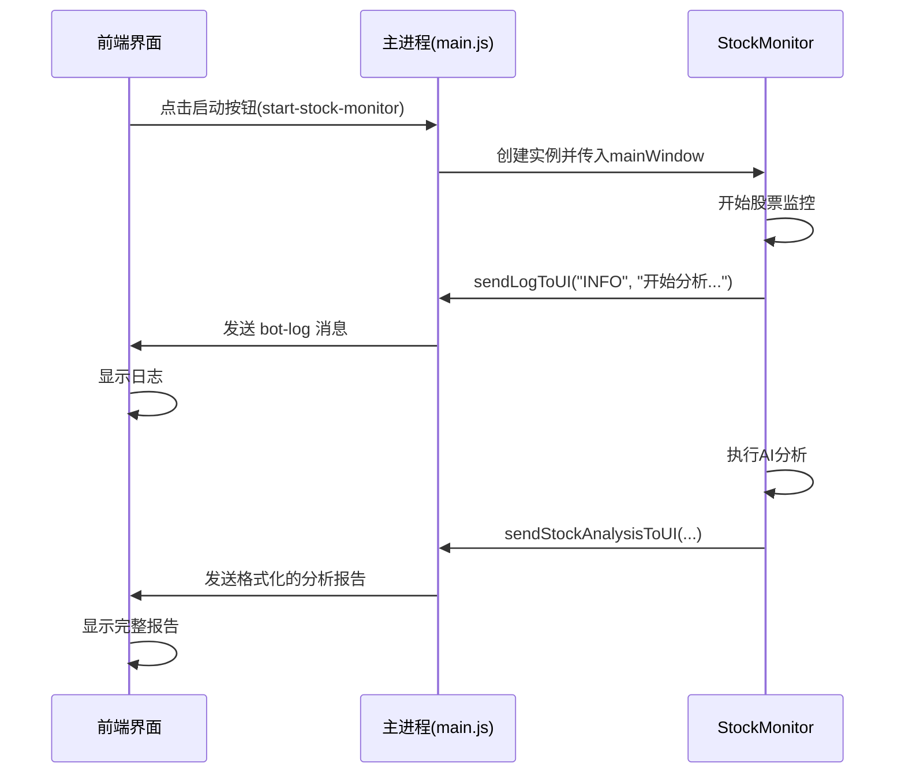

# 股票监控实时UI推送功能说明

## 新增功能

为股票监控添加了实时UI消息推送功能,现在股票分析结果会实时显示在前端界面的日志区域。

## 修改内容

### 1. StockMonitor.js 修改

#### 新增方法:

1. **`sendLogToUI(level, message)`** - 发送日志到UI界面
   - 参数: 日志级别(INFO/WARN/ERROR)、消息内容
   - 功能: 将日志实时推送到前端界面

2. **`sendStockAnalysisToUI(stock, kline, indicators, aiAnalysis)`** - 发送股票分析结果到UI
   - 参数: 股票信息、K线数据、技术指标、AI分析结果
   - 功能: 格式化并推送完整的股票分析报告到前端

3. **`setMainWindow(mainWindow)`** - 设置主窗口引用
   - 参数: Electron主窗口对象
   - 功能: 用于后续发送IPC消息

#### 修改内容:

1. **构造函数** - 新增 `mainWindow` 参数
   ```javascript
   constructor(mainWindow = null)
   ```

2. **`monitorSingleStock()`** - 添加UI消息推送
   - 分析开始时发送: `开始分析 {股票名称}`
   - 无数据时发送: `{股票名称} 无K线数据`
   - 分析完成后调用: `sendStockAnalysisToUI()` 发送完整报告
   - 分析成功后发送: `✅ {股票名称} 分析完成: {决策}`
   - 出错时发送: `监控 {股票名称} 失败: {错误信息}`

### 2. main.js 修改

修改股票监控启动逻辑,传入主窗口引用:

```javascript
// 启动股票监控
ipcMain.on('start-stock-monitor', async (event) => {
  if (!stockMonitor) {
    stockMonitor = new StockMonitor(mainWindow); // 传入主窗口引用
  } else {
    stockMonitor.setMainWindow(mainWindow); // 更新主窗口引用
  }
  // ...
});
```

## 显示效果

前端界面日志区域会实时显示以下信息:

### 1. 分析开始提示
```
[INFO] 开始分析 腾讯控股 (00700.HK)
```

### 2. 完整分析报告
```
━━━━━━━━━━━━━━━━━━━━━━━━━━━━━━━━━━
📊 腾讯控股 (00700.HK) - HK股
━━━━━━━━━━━━━━━━━━━━━━━━━━━━━━━━━━

📈 价格信息:
  • 当前价格: 385.20
  • 涨跌幅: +1.25%
  • 开盘: 380.00 | 最高: 388.50 | 最低: 379.00
  • 成交量: 12345678

🔍 技术指标:
  • RSI: 58.32
  • MACD: 0.0234
  • 布林带: 上390.50 | 中385.00 | 下379.50

🤖 AI分析决策: 买入
💡 决策理由: 股价突破布林带中轨,RSI处于中性偏多区域,MACD呈现金叉信号,建议适量买入。

━━━━━━━━━━━━━━━━━━━━━━━━━━━━━━━━━━
```

### 3. 完成提示
```
[INFO] ✅ 腾讯控股 分析完成: 买入
```

### 4. 错误提示(如有)
```
[ERROR] 监控 小米集团 失败: API请求超时
```

## 使用方式

1. 启动应用
2. 点击"启动股票"按钮
3. 在日志区域实时查看股票分析过程和结果
4. 每次定时任务执行时都会推送新的分析报告

## 技术细节

### IPC通信流程



### 消息格式

所有消息通过 `bot-log` 事件发送:
```javascript
{
  level: 'INFO' | 'WARN' | 'ERROR',
  message: '消息内容'
}
```

## 优势

1. **实时反馈** - 用户可以实时看到股票分析进度
2. **可视化** - 格式化的报告更易阅读
3. **统一日志** - 加密货币和股票监控使用相同的日志系统
4. **错误提示** - 及时显示错误信息,方便调试

## 注意事项

1. 确保在启动股票监控前,Electron主窗口已创建
2. 日志区域会自动滚动到最新内容(可手动关闭自动滚动)
3. 日志数量限制为500条,超过后自动删除最旧的日志

---
更新时间: 2025-11-15
功能: 股票监控实时UI推送
